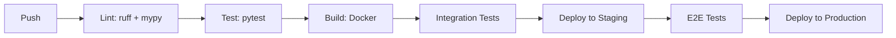

# Contributing to SonarVision

We love contributions! Here's how to get involved.

## 📋 Development Workflow

1. **Fork** the repo on GitHub
2. **Clone** your fork: `git clone https://github.com/YOUR_USER/sonar-vision.git`
3. **Create a branch**: `git checkout -b feat/your-feature`
4. **Set up environment**:
   ```bash
   python -m venv .venv
   source .venv/bin/activate
   pip install -e ".[dev]"
   ```
5. **Make changes** — see [Architecture](ARCHITECTURE.md) for code structure
6. **Run tests**: `pytest tests/`
7. **Lint**: `ruff check . && mypy .`
8. **Commit** using [Conventional Commits](https://www.conventionalcommits.org/):
   - `feat:` new feature
   - `fix:` bug fix
   - `docs:` documentation
   - `perf:` performance improvement
   - `test:` adding tests
   - `refactor:` code restructuring
   - `ci:` CI/CD changes
9. **Push** and open a Pull Request

## 🔬 Development Tips

- Use `sonar-vision-cli.py serve --reload` for hot-reload development
- Run benchmarks: `sonar-vision-cli.py benchmark`
- View API docs: open `docs/API.md` or visit `/docs` when server is running
- For GPU debugging: `CUDA_LAUNCH_BLOCKING=1 pytest tests/`

## 🧪 Testing Guidelines

- **Unit tests**: `tests/test_*.py` — no GPU required
- **Integration tests**: `tests/integration/` — requires GPU
- **Benchmarks**: `benchmarks/` — run with `sonar-vision-cli.py benchmark`
- Coverage target: 80%+

## 📝 Pull Request Template

```markdown
## Description
Briefly describe your changes.

## Type of Change
- [ ] Bug fix
- [ ] New feature
- [ ] Performance improvement
- [ ] Documentation update

## Testing
- [ ] Unit tests pass
- [ ] Integration tests pass
- [ ] Benchmarks show no regression

## Checklist
- [ ] Code follows project style
- [ ] Docs updated
- [ ] Tests added/updated
- [ ] Changelog entry added
```

## 🏗️ Project Structure

```
sonar-vision/
├── sonar_vision/        # Core Python package
│   ├── water/           # Underwater physics models
│   ├── encoder/         # Depth data encoders
│   ├── decoder/         # Video decoders
│   └── federated/       # Federated learning
├── configs/             # YAML configuration files
├── tests/               # Test suite
├── docs/                # Documentation
├── benchmarks/          # Performance benchmarks
├── demo/                # Demo notebooks
└── scripts/             # Utility scripts
```

## 🚀 CI/CD Pipeline



## 📬 Getting Help

- Open an issue for bugs/features
- Ask in PR comments for code review
- Check [TUTORIALS.md](docs/TUTORIALS.md) for guided walkthroughs
