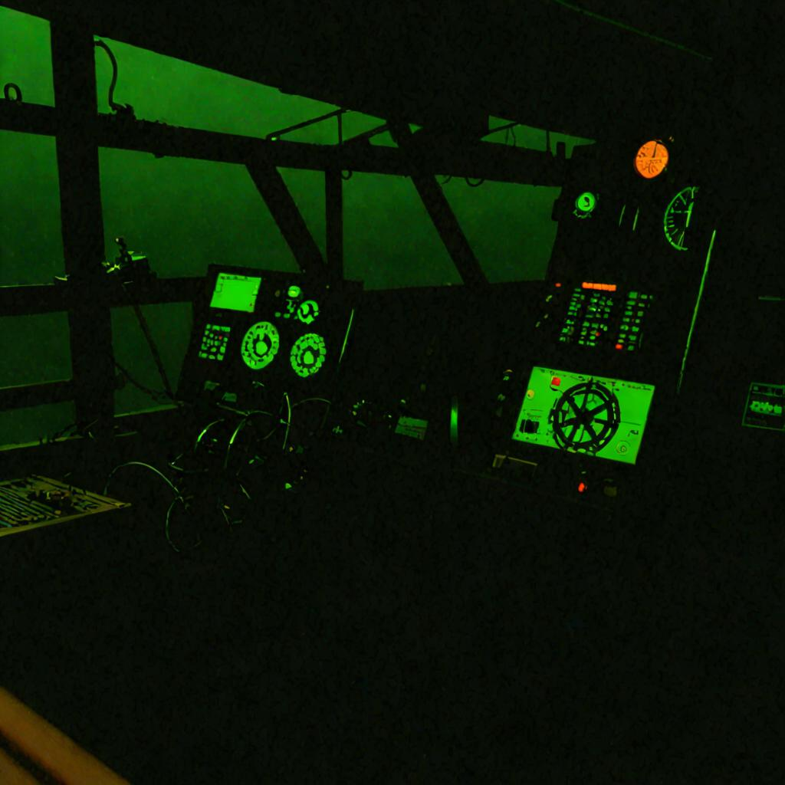
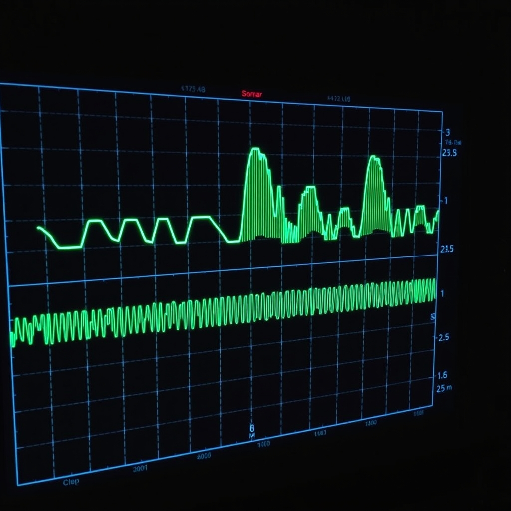
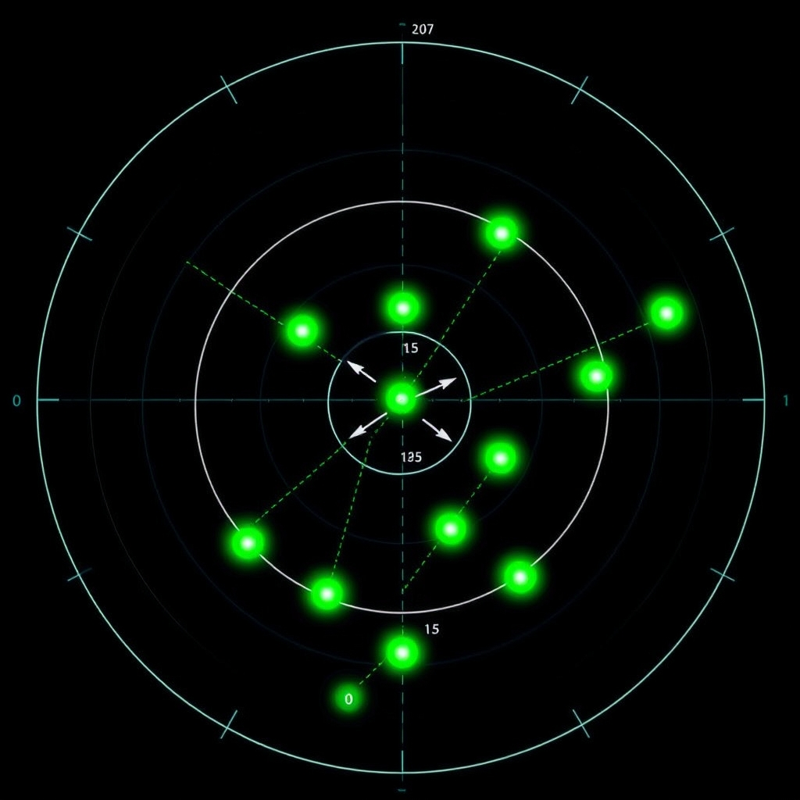
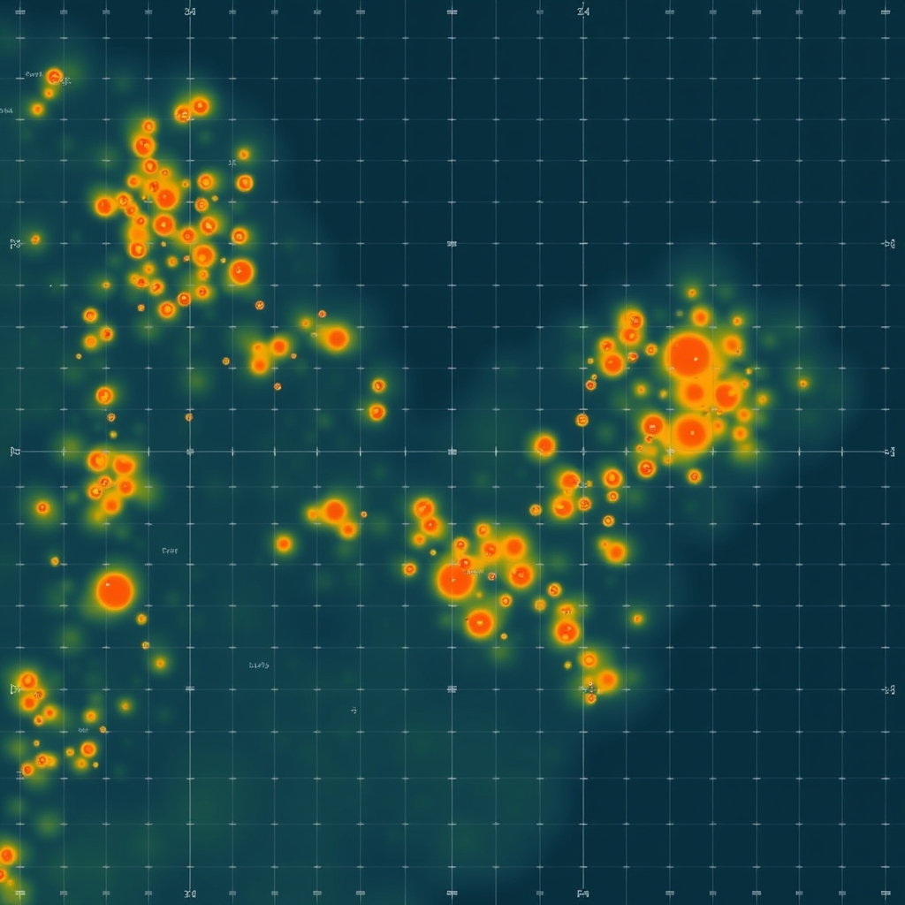

# Sonar Vision

> **📚 Documentation:** [`PLUG_AND_PLAY.md`](./PLUG_AND_PLAY.md) · [`GETTING_STARTED.md`](./GETTING_STARTED.md) · [`ARCHITECTURE.md`](./ARCHITECTURE.md) · [`API_REFERENCE.md`](./API_REFERENCE.md) · [`LOW_LEVEL.md`](./LOW_LEVEL.md)

[](./LICENSE)
[](https://www.python.org/)

Sonar Vision is a pure-Python library for simulating active sonar and working
with the signals it produces. It models acoustic pings and two-way propagation
loss, generates synthetic echo returns, performs discrete-time signal
generation and filtering, tracks moving objects across a sequence of
detections, and builds 2-D occupancy grids from sonar returns.

It has no runtime dependencies beyond the Python standard library — no
scientific packages, audio hardware, or device drivers are needed. The physics
is intentionally simplified for fast simulation and prototyping, not for
high-fidelity ocean-acoustics modelling (see [Limitations](#limitations)).

It is intended for simulation, algorithm prototyping, and educational use in
marine robotics — for example, exercising tracking or mapping pipelines before
deploying real hardware, or generating synthetic sonar returns as training data.



---

## Table of Contents

- [How it works](#how-it-works)
- [Installation](#installation)
- [Quick start](#quick-start)
- [API overview](#api-overview)
- [Limitations](#limitations)
- [What it is not](#what-it-is-not)
- [Testing](#testing)
- [License](#license)

---

## How it works

Sonar Vision is organised around five classes, each handling one stage of a
sonar perception pipeline:

- **`Sonar`** — the active sonar model. A ping computes two-way transmission
  loss as spherical spreading (`20·log₁₀ R`) plus a configurable constant
  absorption coefficient (dB/km), applies a target-strength term, and returns a
  `PingResult` with a received-signal estimate, an SNR in dB, and a distance
  reading that includes small range-proportional jitter.
- **`Signal`** — a discrete-time signal (a sample list plus a sample rate).
  Synthesises sine waves, linear chirps, and random noise; filters with
  moving-average low-/high-/band-pass; and measures RMS, energy, envelope, and
  a naïve DFT magnitude spectrum.

  
- **`ObjectTracker`** — associates detections to existing tracks using greedy
  nearest-neighbour matching inside a distance gate, estimates per-track
  velocity with exponential smoothing, and predicts future positions with a
  constant-velocity model. Tracks time out after a configurable period with no
  detection.

  
- **`SpatialMap`** — a rectangular occupancy grid (`UNKNOWN` / `FREE` /
  `OCCUPIED`). Supports cell access, obstacle insertion with radius footprints,
  DDA-style ray casting, and marking free space along a sonar sweep.

  
- **`SonarDisplay`** — an ASCII renderer. Produces top-down radar sweeps from
  bearing/distance readings, ASCII occupancy maps, and tracker overlays with
  velocity vectors.

## Installation

```bash
pip install sonar-vision
```

**Requirements:** Python 3.10 or later. No runtime dependencies; `pytest>=7` is
listed under the `dev` extra for running the test suite.

## Quick start

```python
from sonar_vision import Sonar, ObjectTracker, Detection

# Active sonar model centred at 50 kHz with a 500 m detection ceiling
sonar = Sonar(frequency=50000, max_range=500)

# Ping a target at 100 m
result = sonar.ping(distance=100)
print(f"Distance: {result.distance:.1f}m, SNR: {result.snr_db:.1f} dB")

# Track objects across three successive detection frames
tracker = ObjectTracker()
tracker.update([Detection(x=10, y=20)])
tracker.update([Detection(x=12, y=22)])
tracker.update([Detection(x=14, y=19)])
print(f"Tracks: {len(tracker.tracks)}")
```

Running the above prints a distance near 100 m with an SNR around 38 dB, and one
track whose velocity is estimated from the three detections.

## API overview

### `Sonar`

Active sonar model. Configurable sound speed, frequency, pulse duration,
maximum range, beam width, source level, and noise level.

| Method | Description |
|--------|-------------|
| `ping(distance, target_strength=-20.0)` | Simulate a full ping → echo cycle; returns a `PingResult` |
| `ping_return_signal(distance, ...)` | Build a synthetic echo waveform (transmit pulse, silence, attenuated echo) |
| `generate_ping(sample_rate)` | Generate the transmit tone burst as a `Signal` |
| `round_trip_time(distance)` | Two-way travel time from range |
| `distance_from_time(travel_time)` | Inverse of `round_trip_time` |
| `spreading_loss(distance)` | One-way spherical spreading loss, `20·log₁₀ R` (dB) |
| `absorption_loss(distance, absorption_db_km=10.0)` | Absorption loss from a constant dB/km coefficient |
| `total_loss(distance, absorption_db_km=10.0)` | Sum of spreading and absorption loss (one way) |
| `in_beam(bearing_offset_deg)` | Whether a bearing falls inside the beam width |
| `beam_coverage()` | Angular beam coverage in degrees |

### `Signal`

A discrete-time signal (`samples`, `sample_rate`). Constructors: `sine()`,
`noise()`, `chirp()`. Resampling: `resample()`. Filters: `lowpass()`,
`highpass()`, `bandpass()`, `threshold()`, `envelope()`. Measurements: `rms()`,
`peak()`, `energy()`, `dominant_frequency()`, `dft_magnitude()`, `snr_db()`.
Supports `+` and `*` (scalar or signal).

### `ObjectTracker`

Multi-object tracker with a constant-velocity motion model and greedy
nearest-neighbour, gate-limited association. Configurable `association_gate`
(m), `max_velocity` (m/s), and `lost_timeout` (s). Exposes `predict()`,
`predict_all()`, `active_tracks()`, `prune_lost()`, and spatial queries
(`nearest_track`, `tracks_in_radius`, `speed`, `heading`).

### `SpatialMap`

2-D occupancy grid (`CellState`: `UNKNOWN` / `FREE` / `OCCUPIED`), sized by
`width`, `height`, and `resolution` (all in metres). Cell access: `get_cell()`,
`set_cell()`. Obstacles: `add_obstacle()` (marks cells within the radius),
`remove_obstacle()`. Queries: `is_occupied()`, `nearest_obstacle()`,
`obstacles_in_radius()`, `distance_to_nearest()`. Geometry: `ray_cast()`,
`mark_free_ray()`. Stats: `occupancy_count()`, `coverage()`.

### `SonarDisplay`

ASCII renderer (`width`, `height`, `range_m`). `render_sweep()` plots
bearing/distance readings on a polar grid with range rings; `render_map()`
down-samples a `SpatialMap` to characters; `render_tracks()` overlays active
tracks with velocity vectors.

See [`API_REFERENCE.md`](./API_REFERENCE.md) for the full API.

## Limitations

The models are deliberately simple and trade accuracy for speed and
readability. Be aware of the following approximations:

- **Propagation is spherical spreading only.** Loss is `20·log₁₀ R`; there is no
  cylindrical-spreading option or range-dependent mode mixing.
- **Absorption does not vary with frequency.** It is a single constant dB/km
  coefficient you pass in (default `10.0`); it is not derived from the
  transducer frequency or water properties.
- **Filters are moving-average approximations**, not designed IIR/FIR filters.
  `highpass` subtracts the low-pass result from the input; corner response is
  approximate.
- **`dft_magnitude` is a naïve O(N²) implementation** intended for short
  signals. There is no FFT.
- **Association is greedy nearest-neighbour**, not globally optimal and not
  multi-hypothesis. Closely spaced targets can be mis-associated.
- **Single-beam sonar only.** There is no phased-array or multi-beam modelling.

## What it is not

- **Not a real-time hydrophone processing stack.** It simulates sonar physics
  in Python; it does not interface with audio hardware or NMEA devices.
- **Not a video or camera system.** There is no video prediction, multi-camera
  learning, or image processing in this codebase.
- **Not a high-fidelity ocean-acoustics solver.** Propagation models are
  intentionally simple (geometric spreading + configurable dB/km absorption)
  for fast simulation and prototyping.
- **Not a beamforming library.** Single-beam sonar is modelled; phased arrays
  and multi-beam reconstruction are out of scope.

---

## How It Fits

⚠️ **This is the original copy; active maintenance continued elsewhere.**
Development of sonar-vision moved to
[purplepincher/sonar-vision](https://github.com/purplepincher/sonar-vision),
which carries everything in this repository (identical tree at the
production-grade merge, shared commit history up to it) plus subsequent
hardening
(unmasked CI that actually fails on test failures, a documentation
honesty pass, a `CHANGELOG.md`, and additional test coverage). New work
lands there; this copy is kept as the SuperInstance sketchbook original
and may lag behind.

---

## Testing

```bash
pip install pytest
pytest tests/
```

The suite contains 86 tests across `tests/test_all.py` (unit tests for each
class) and `tests/test_simulation_scenarios.py` (end-to-end tracking and mapping
scenarios, including well-separated, crossing, and beam-edge targets).

## License

MIT © SuperInstance Labs — see [`LICENSE`](./LICENSE).
